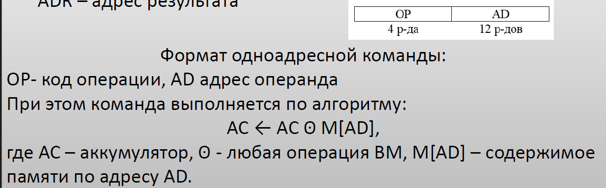
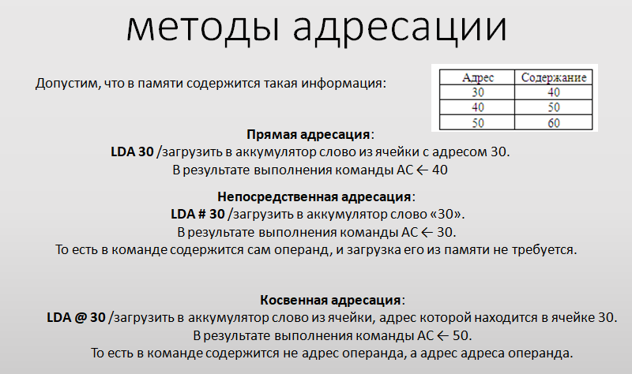

# Описание
Проект заключается в описании модели регистров и памяти процессора, а также проверки модели путем составления тестовой программы с предсказуемым результатом исполнения. После записи команд тестовой программы в массив, имитирующий память процессора, запуск модели должен привести к пошаговому моделированию состояний процессора при выполнении каждой из команд. Корректность модели и программы определяется достижением заранее определенного результата вычислений

# Формирование требований к процессору

## Функциональные
 * Разработать описание последовательности действий процессора при выполнении основных команд. Описание рекомендуется создавать на базе оператора case/switch (в зависимости от используемого языка программирования 
 * Разработать тестовую программу по заданию преподавателя. Тестовая программа создается в режиме прямого программирования полей каждой команды, которые записываются в ячейки массива cmem[].
 * Выполнить моделирование работы процессора при выполнении тестовой программы. Для этого необходимо организовать циклическое выполнение последовательности «чтение команды из памяти – имитация выполнения команды оператором case» с выводом на экран состояния регистров и фрагмента памяти данных процессора.

## Нефункциональные
Эмулятор должен отображать на экране состояние:
 * регистры общего назначения (в том числе аккумулятор и счетчик), 
 * счетчик команд
 * регистр команд
 * регистр флагов или отдельные флаги, которые необходимы
 * В регистре команд отображать не только текущую исполняемую команду в
 машинном коде, но и её ассемблерное представление. Также отобразить
 отдельные поля команды.

Требования к ОЗУ:
* В эмуляторе должен содержаться блок или блоки ОЗУ. 
* ОЗУ можно не отображать на форме эмулятора. 
* Количество ячеек
ОЗУ лучше ограничить несколькими тысячами единиц, чтобы не возникла идея 
о сложной организации памяти. 
* ОЗУ заполняется программой и обрабатываемыми массивами: данными. 
* Первым элементом массива идет его номер.

Требования к эмуляции:
* Эмуляция работы процессора происходит как запись изменений значений  
в компонентах, указанных выше после выполнения каждой команды

Требования к системе команд следующие:
* Команды выполняют операции над скалярами
* Команды должны соответствовать RISC-архитектуре: иметь  
фиксированную длину и в памяти может находиться только один из операндов команды
* Размер команд лучше ограничить 16 битами в случае безадресных
и **одноадресных команд** - *из ходя из условия важно*! 
* Размер ячеек памяти ОЗУ проще выбрать под размер
команды - т.е. тоже 16 бит

Типы команд:
* команды пересылки данных
* арифметико-логические команды, в том числе и операции длинной арифметики
* команды условных переходов
* В эмуляторе допускается прописывание только необходимых команд

Типы аддресации:
* непосредственная
* прямая
* регистровая
* косвенно-регистровая.

Требование к тестовым данным:
* Программы, которые заложены в эмуляторе, должны выполнять действия над массивами в цикле. 
* Размер массива лучше ограничить 7-15 элементами. 
* Допускается заполнение массива и программы на этапе инициализации.

# Подготовка отчета
## Описание регистровой модели процессора с перечислением регистров и их назначения
Используемый набор регистров, каждый по 16 бит по условию:

    Accumulator (AC): регистр для хранения промежуточных результатов вычислений. - По условию нужен.
    Program Counter (PC): хранит адрес текущей команды. - По условию нужен.
    Instruction Register (IR): хранит текущую выполняемую команду.- По условию нужен.
    General-Purpose Registers (R0-R3): используются для хранения данных. AX\BX\CX\DX. - 
        Эти регистры используются для хранения промежуточных данных, которые требуются для выполнения арифметических или логических операций.
    Flag Register (FLAGS): хранит флаги (например, Carry, Zero). - По условию нужен. https://www.geeksforgeeks.org/flag-register-8086-microprocessor/
### Про флаги из методички:
Наиболее распространенные флаги:

    * флаг нуля (Zero Flag), равен 1, если последний из вычисленных процессором результатов был равен 0;
    * флаг переноса (Carry Flag), равен 1, если последний из вычисленных процессором результатов потребовал 
    перенос в несуществующий старший разряд или заем из несуществующего старшего разряда.

## Использованных форматов команд процессора
Формат опирался на материал из презентаций 3 семестр

Для поддержки 4 форматов адресации было выделено 2 бита. Поэтому итоговый формат команд:
*	4 бита - код команды (всего 16 команд); 
*	2 бита - тип адресации (всего 4 типа); 
*	10 бит - адрес в памяти (всего доступно – 1024 ячейки. т.к. в одной ячейке 16 бит, то всего 16 кБит).
### Адрессация
По заданию: непосредственная, прямая, регистровая и косвенно-регистровая.

Кодирование исходя из материалов презентаций

    
    непосредственная
    
    прямая
    
    регистровая
    
    косвенно-регистровая.

## 
Память разделена на 2 вида (согласно https://digteh.ru/dsp/garvard/):
* Память программ (для хранения инструкций микропроцессора)
* Память данных (для временного хранения и обработки переменных)
Каждя ячейка памяти - 16 бит, по условию.
